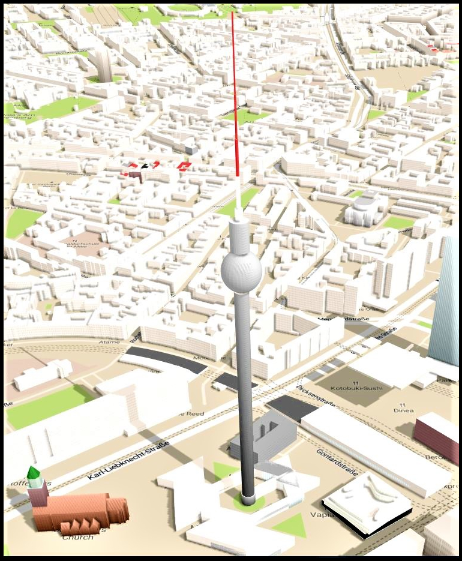
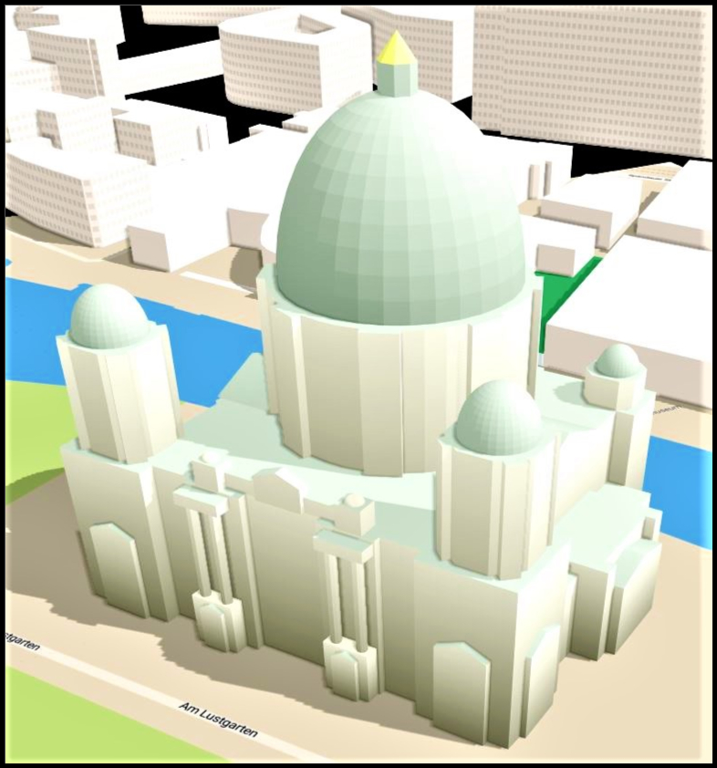

\# Live Demo: 3DCity Model Repository

<https://rawcdn.githack.com/MohammadNasim/3DCity/15078c89e9becfbf77a49c0fc557c252971b4db4/index.html?lat=52.525118&lon=13.409785&zoom=16.8&tilt=45.0&rotation=0.0>

\# Detailed 3D objects in OSM

3D Model Repository is available
at [<u>https://3dmr.eu</u>](https://3dmr.eu/)

The aim of the project is to enable high detail 3D rendering map data
using real 3D models. And this is how it has been done so far.

Now we are able to store a range of objects and details, from landmarks
such as the Eiffel Tower down to repeating benches on a street.

During Google Summer of Code project last year Pedro developed the
platform, mentored by Jan from OSM Buildings and Tobias from OSM2World.
He also set up the infrastructure required for launch which is
generously funded by FOSSGIS.

On renderer side, user karlos has been making great progress with his
project OSM go. He provided us with an easy way to test features of our
project.

This is how it would like in OSM Buildings, from 3D design to final
object on the map.

